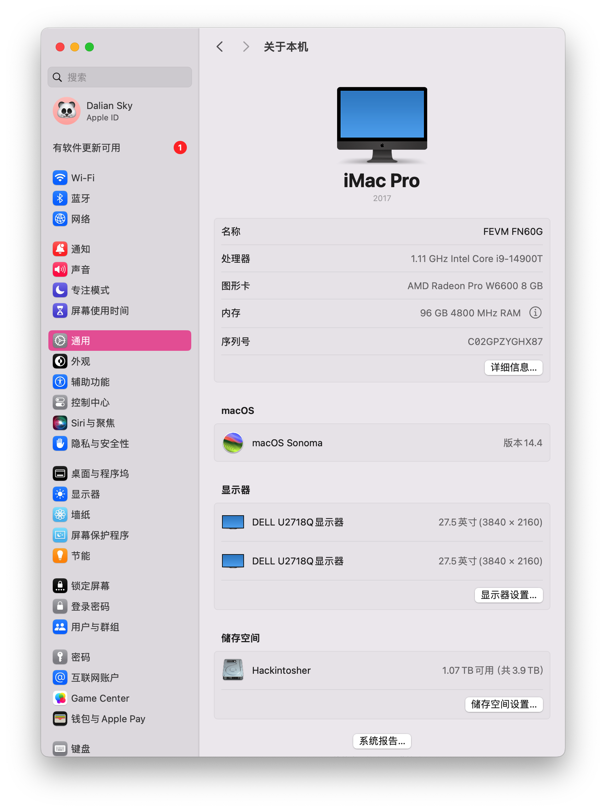
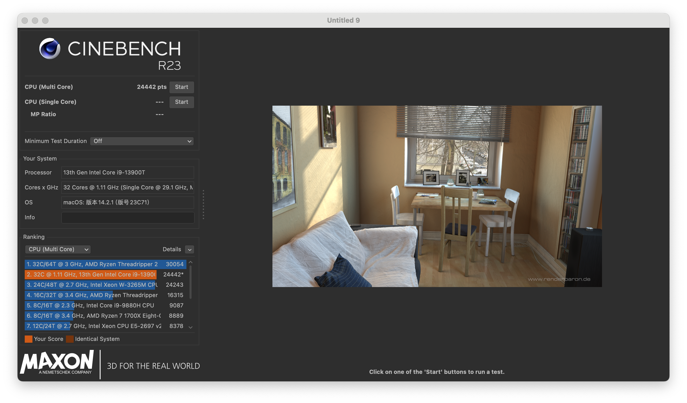
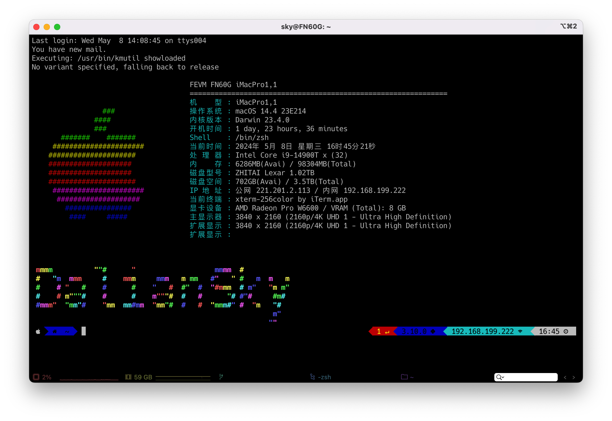
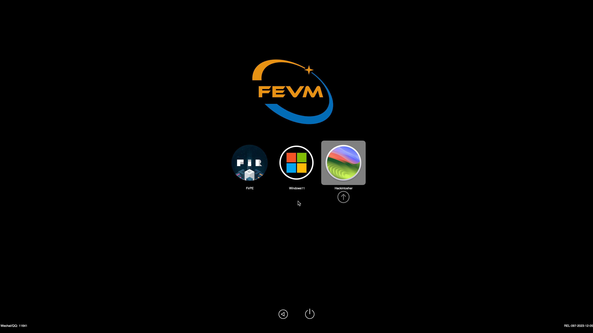

# FEVM-FN60G-Hackintosh

## 配置清单

| 部件             | 型号                                    | 是否支持                                                     |
| :--------------- | :-------------------------------------- | :----------------------------------------------------------- |
| CPU              | INTEL i9-13900T / i7-13700T / i5-13600T | 支持                                                         |
| 内存             | 三星DDR5 5600MHz                        | 支持                                                         |
| 核显             | ~~Intel® Iris® Xe Graphics eligible~~   | macOS不支持                                                  |
| 独立显卡         | AMD Radeon™ RX 6600M                    | 支持，`HDMI`x1 `4K@144Hz` `DP` x2 `4K@144Hz` `Type-C` x1 `4K@144Hz` |
| 网卡             | BCM94360NG/Z3/Z4/INTEL AX200            | 支持，Intel AX200不支持隔空                                  |
| 蓝牙             | BCM94360NG/Z3/Z4/INTEL AX200            | 支持                                                         |
| 硬盘1            | PCI-E 4.0 最高支持 4TB                  | 支持                                                         |
| 硬盘2            | PCI-E 4.0 最高支持 4TB                  | 支持                                                         |
| USB              | 20Gbps / 10Gbps                         | 支持                                                         |
| 音频/3.5耳机接口 | ALC897 id:`111`                         | 支持                                                         |
| 音频/HDMI输出    |                                         | 支持                                                         |
| 隔空             |                                         | 支持                                                         |
| 接力             |                                         | 支持                                                         |
| 随航             |                                         | 未测试，不确定是否支持                                       |
| 通用控制         |                                         | 支持                                                         |

## 更新日志

- 3-1-2024

  - 更新`OpenCore Mod` 到 `v0.9.9`
  
- 1-17-2024

  - 更新`OpenCore Mod` 到 `v0.9.8`
  - 修复超线程
  - 修复cpu型号显示异常

  

## 截图

