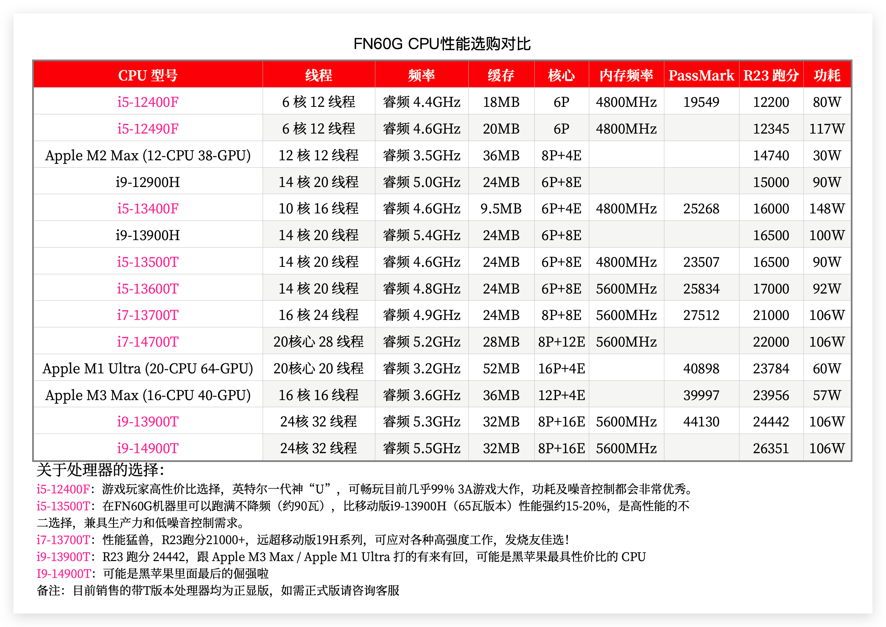
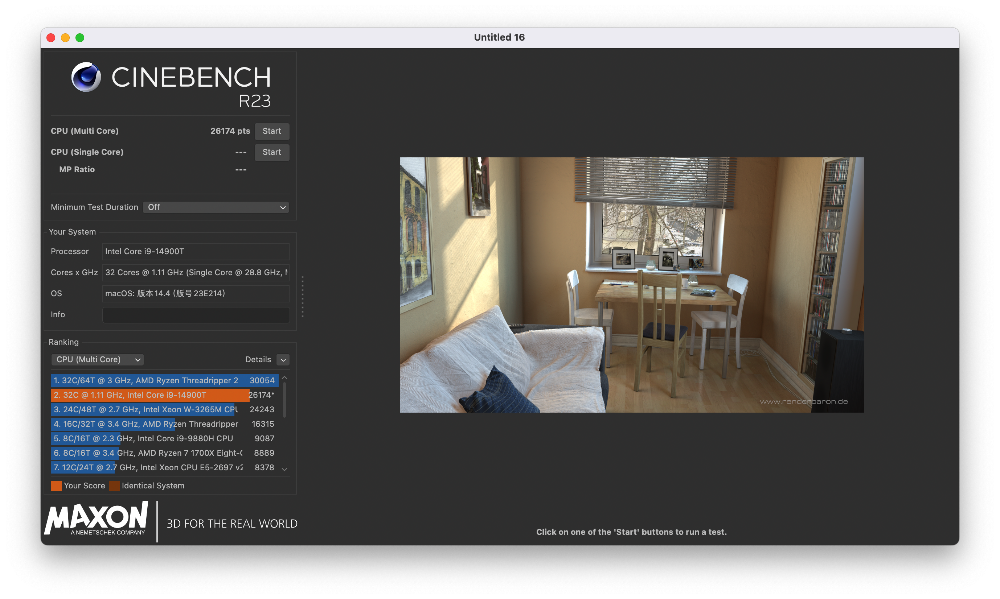

# FEVM-FN60G-Hackintosh

## 配置清单

| 部件             | 型号                                                 | 是否支持                                                     |
| :--------------- | :--------------------------------------------------- | :----------------------------------------------------------- |
| CPU              | INTEL `i9-14900T` / `i9-13900T` / `i7-13700T`  / `i5-13600T` / `i5-13400F` / `i5-12400F`              | 支持                                                         |
| 内存             | 三星/英睿达/镁光 DDR5 5600MHz                        | 支持                                                         |
| 核显             | ~~Intel® Iris® Xe Graphics eligible~~                | macOS不支持                                                  |
| 独立显卡         | AMD Radeon™ RX 6600M                                 | 支持，`HDMI`x1 `4K@144Hz` `DP` x2 `4K@144Hz` `Type-C` x1 `4K@144Hz` |
| 网卡             | BCM94360NG/Z3/Z4/INTEL AX200                         | 支持，Intel AX200不支持隔空                                  |
| 蓝牙             | BCM94360NG/Z3/Z4/INTEL AX200                         | 支持                                                         |
| 硬盘1            | PCI-E 4.0 最高支持 4TB 英睿达/长存颗粒+联芸主控 | 支持                                                         |
| 硬盘2            | PCI-E 4.0 最高支持 4TB 英睿达/长存颗粒+联芸主控 | 支持                                                         |
| USB              | 20Gbps / 10Gbps                                      | 支持                                                         |
| 音频/3.5耳机接口 | ALC897 id:`98`                                       | 支持                                                         |
| 音频/HDMI输出    |                                                      | 支持                                                         |
| 隔空             |                                                      | 支持                                                         |
| 接力             |                                                      | 支持                                                         |
| 随航             |                                                      | 不支持                                                       |
| 通用控制         |                                                      | 支持                                                         |

## 更新日志

- 9-22-2024
  - 更新 `OpenCore` `v1.0.2` 开发版
  - 更新 `IOSkywalkFamily.kext` 到 `v1.2.0`
  - 支持 `Sequoia` (博通无线网卡)
  - 支持 `Sonoma` (Intel无线网卡)
- 3-11-2024

  - 更新 `IOSkywalkFamily.kext` 到 `v1.1.0`
  - `Sonoma` 如果想更新到 `14.4` 请务必先更新 `EFI` ，然后再安装 [OCLP](https://pan.daliansky.net/APPS/OCLP/OCLP.md)，重启后，再升级到 `14.4` 否则会出现 `WIFI` 无法启用的问题
  
- 3-1-2024

  - 更新`OpenCore Mod` 到 `v0.9.9`

- 1-17-2024

  - 更新`OpenCore Mod` 到 `v0.9.8`
  - 修复超线程
  - 修复cpu型号显示异常

  

## 截图

